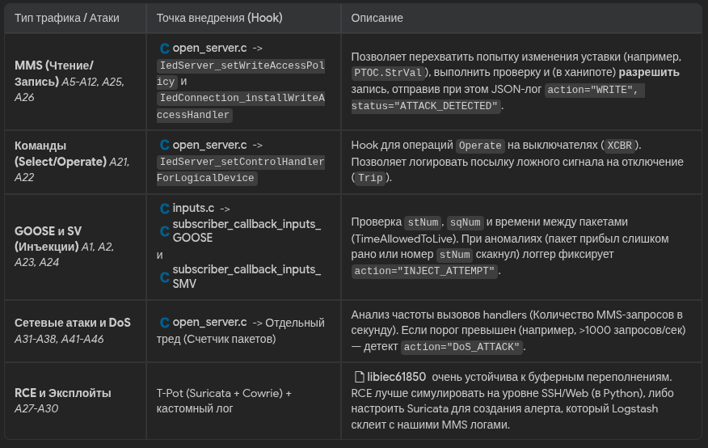

# HoneypotLogger Implementation 2

## 1. Анализ и планирование

Сейчас проект эмулирует физику и протоколы (MMS, GOOSE, SV). Нужно реализовать еще дополнительные функции на оснвое списка возможных опасных атак (А1-А46)

## 2. Описание задачи

Составить архитектуру и логику перехвата для всех основных векторов атак (MMS подмены, GOOSE/SV инъекции и DoS).
Основная идея для ханипота: мы разрешаем атакующим успешно производить запись (изменять уставки), чтобы они думали, что атака A12/A6 прошла успешно, но при этом если IP не совпадает с "легитимным" АРМ (например, контейнером инженера), мы создаем лог о взломе. Для DoS мы запустим фоновый поток мониторинга нагрузки (Token Bucket) прямо в open_server.c.


## 3. Механизмы перехвата (Hooks) в vIED

Для фиксации опасных событий (подмена конфигураций, инъекция GOOSE/SV, ложные Trip-сигналы и DoS) мы интегрируем логику детектирования непосредственно в движок iec61850_open_server. Суть высокоинтерактивного ханипота — позволять злоумышленнику "успешно" выполнить атаку (чтобы он думал, что взломал ПС), но при этом фиксировать её в фоне:

- разобрал точки перехвата (Hooks) и фрагменты кода для каждой категории.
- подход с потоком мониторинга DoS и разрешением на MMS-запись 



## 4. Логика детектирования

### 4.1 Для MMS: Как отличить легитимную запись (A11) от атаки (A12)?

В ханипоте грань между "легитимным" и "атакой" зависит от контекста. Различать их можно по IP-адресу источника и контексту сессии. В T-Pot вы можете назначить одному из Docker-контейнеров роль "Engineering Workstation (АРМ РЗА)" (например, 192.168.1.10).

Алгоритм:

- Если src_ip == "192.168.1.10" — это симуляция легитимной инженерии (A11).
- Если src_ip != "192.168.1.10" — это 100% несанкционированный доступ (Атака A12).
- Дополнительно: Хакеры используют агрессивные сканеры. Легитимное ПО перед записью делает GetVariableAccessAttributes. Если запись прилетела без предварительного чтения структуры (слепое изменение скриптом), это маркер атаки.

```c
static MmsDataAccessError
mmsWriteHandler(DataAttribute* dataAttribute, MmsValue* value, ClientConnection connection, void* parameter)
{
    char clientIp[64] = "UNKNOWN";
    if (connection) ClientConnection_getPeerAddress(connection, clientIp);
    
    char objRef[128];
    StringUtils_copyStringToBuffer(dataAttribute->name, objRef);

    // Определяем, легитимна ли запись
    const char* status = (strcmp(clientIp, "192.168.1.10") == 0) ? "AUTHORIZED" : "UNAUTHORIZED_ATTACK";

    // Логируем (событие A12/A8)
    Logger_LogMmsAction("WRITE", clientIp, 102, objRef, "new_value", status);

    // ХАНИПОТ: Мы РАЗРЕШАЕМ запись, чтобы удержать атакующего и показать ему "успех" 
    // Если это ловушка, мы можем обновить локальную фейковую модель:
    IedServer_updateAttributeValue((IedServer)parameter, dataAttribute, value);

    return DATA_ACCESS_ERROR_SUCCESS; // Успех для атакующего!
}

// В main():
// IedServer_setWriteAccessPolicy(server, IEC61850_FC_SP, ACCESS_POLICY_ALLOW); // Включаем возможность изменения уставок!
// IedServer_setWriteAccessHandler(server, mmsWriteHandler, server);
```

## 4.2 Для GOOSE/SV: Обнаружение инъекций и аномальной частоты (A23, A24)

Каждый GOOSE/SV пакет содержит последовательность stNum (изменяется при событии) и sqNum (счетчик ретрансляции). Каждое сообщение также содержит параметр TimeAllowedToLive (TAL).

Алгоритм обнаружения (Инъекций и Replay-атак):

- Replay (повтор пакета): Если получен пакет с sqNum <= текущий_sqNum при неизменном stNum.
- Inject (подмена пакета): Если дельта времени между пакетами с одинаковым stNum резко сократилась (например, пришел пакет через 1 мс, а ожидался через 1000 мс — stNum инжектирован другим генератором).
- Seq Skip: Если stNum или sqNum "скакнул" вперед более чем на 1 — возможно, мы слушаем легитимный пакет и инъекцию одновременно.

```c
static uint64_t last_goose_time_ms = 0;

void subscriber_callback_inputs_GOOSE(GooseSubscriber subscriber, void *parameter)
{
    uint64_t current_time = Hal_getTimeInMs();
    int32_t current_sqNum = GooseSubscriber_getSqNum(subscriber);
    int32_t current_stNum = GooseSubscriber_getStNum(subscriber);
    uint32_t timeAllowedToLive = GooseSubscriber_getTimeAllowedToLive(subscriber);
    
    InputValue *inputVal = (InputValue *)parameter;
    
    if (inputVal->RefCount != -1) {
        int32_t expected_sqNum = inputVal->RefCount + 1;
        uint64_t delta_time = current_time - last_goose_time_ms;

        // 1. Проверка на Replay / Спуфинг SqNum
        if (current_sqNum < expected_sqNum && current_sqNum != 0) {
            Logger_LogGooseAnomaly("UNKNOWN_MAC", inputVal->extRef->Ref, "REPLAY_ATTACK_A24: sqNum is lower than expected");
        }
        
        // 2. Проверка на инъекцию (Flood)
        // Если пакет пришел сильно раньше положенного ретрансляционного окна (обычно это TAL / 2) 
        // и stNum не изменился (не было реального физического события)
        if (delta_time < 5 && current_stNum == inputVal->stNum_cache) {
            Logger_LogGooseAnomaly("UNKNOWN_MAC", inputVal->extRef->Ref, "INJECTION_A24: Unrealistic packet frequency (< 5ms without stNum change)");
        }
    }
    
    inputVal->RefCount = current_sqNum;
    inputVal->stNum_cache = current_stNum;
    last_goose_time_ms = current_time;
    
    // ... стандартная логика обновления ...
}
```

## 4.3 Для DoS: Мониторинг нагрузки на сетевой стек (A31-A38)

DoSe (Отказ в обслуживании) для ПС (Подстанции) очень критичен. Чтобы зафиксировать попытки DoS-атак на MMS или GOOSE без реального падения контейнера (T-Pot должен выживать), мы сделаем In-App мониторинг частоты запросов.

Алгоритм "Token Bucket" для метрик:

- Заведем глобальные атомарные счетчики: mms_requests_count, goose_packets_count.
- В каждом Callback-е инкрементируем их.
- Запустим фоновый pthread (DosMonitor), который раз в секунду считывает эти счетчики, обнуляет их и проверяет лимит.
- Если goose_packets_count > 5000 (для вашей сети норму нужно откалибровать), пишем в JSON лог алерт DoS_ATTACK_GOOSE.

```c
#include <stdatomic.h>
#include <pthread.h>

static atomic_int mms_req_cnt = 0;
static atomic_int goose_req_cnt = 0;

// Фоновый поток (вызывается из main)
void* dos_monitor_thread(void* arg) {
    while(open_server_running()) {
        Thread_sleep(1000); // 1 раз в секунду
        
        int mms_rate = atomic_exchange(&mms_req_cnt, 0);
        int goose_rate = atomic_exchange(&goose_req_cnt, 0);

        if (mms_rate > 500) { // A33-A36
            char reason[64];
            snprintf(reason, sizeof(reason), "MMS DoS (Rate: %d req/s)", mms_rate);
            Logger_LogEvent("MMS", "DoS_ATTACK", "MULTIPLE", 0, "SYSTEM", "", reason);
        }
        
        if (goose_rate > 3000) { // A31-A32
            char reason[64];
            snprintf(reason, sizeof(reason), "GOOSE/SV DoS Flood (Rate: %d pkts/s)", goose_rate);
            Logger_LogEvent("GOOSE", "DoS_ATTACK", "MULTIPLE", 0, "SYSTEM", "", reason);
        }
    }
    return NULL;
}

// В `inputs.c` внутри `subscriber_callback_inputs_GOOSE`:
atomic_fetch_add(&goose_req_cnt, 1);
```

## 5. Программная реализация

Произведена интеграция архитектуры детектирования кибератак в iec61850_vIED_honeypot, а также успешная ре-компиляция проекта:

- Добавить WriteAccessHandler и разрешить изменение уставок на сервере для правдоподобности ханипота.
- Внедрить поток dos_monitor_thread.
- Модифицировать inputs.c  для глубокой проверки sqNum и времени
- Implement MMS Write Access Handler (A5-A12)
- Implement GOOSE/SV Sequence Anomaly Detection (A1-A2, A23-A24)
- Implement DoS Monitor Thread in open_server.c (A31-A38)

### MMS Write Перехватчик (A5-A12)

- В open_server.c добавлена функция mmsWriteHandler, которая была рекурсивно подключена ко всем объектам модели данных (ModelNode -> DataObjectModelType) для категорий SP, CF, DC.
- Теперь IedServer разрешает запись уставки (для поддержания иллюзии уязвимости — ханипота), но если источник не совпадает с IP-адресом инженера (например, 192.168.1.10), логгер генерирует событие со статусом UNAUTHORIZED_ATTACK.

### DoS Мониторинг (A31-A38)

- В open_server.c добавлен фоновый поток dos_monitor_thread.
- Использованы атомарные счетчики (stdatomic.h) mms_req_cnt и goose_req_cnt, которые инкрементируются в различных callback-функциях.
- Один раз в секунду поток агрегирует эти значения. При превышении порога (например, >500 MMS или >3000 GOOSE запросов в секунду), в JSON-журнал отправляется алерт DoS_ATTACK.

### GOOSE Инъекции и Anomaly Seq (A1-A2, A23-A24)

- Для трекинга stNum и таймстемпов мы расширили структуру InputValue в inc/inputs_api.h.
- В input/inputs.c (subscriber_callback_inputs_GOOSE) реализована проверка:
    - Если sqNum меньше ожидаемого (Replay Attack).
    - Если пакет пришел аномально быстро (< 5 мс) без изменения stNum (Injection Flood).
- При обнаружении вызывается Logger_LogGooseAnomaly.

### Адаптация API Логгера

- В inc/honeypot_logger_c_api.h добавлена универсальная обертка Logger_LogEvent для генерации DoS-событий в C++.

## Как тестировать

- можно симулировать легитимный трафик чтения/записи GOOSE и MMS, затем запустить флуд с помощью скриптов (e.g. Scapy) и проверить /var/log/tpot/vied_events.json на наличие событий INJECTION или DoS.
- Для проверки MMS атак можно воспользоваться iec61850-client Python-библиотекой для изменения случайного SP (Setpoint) атрибута.